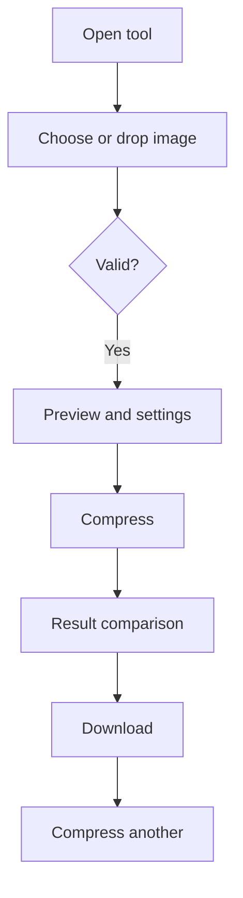

# 02 — UX, UI, Design System, dan Accessibility

## 1. UX Principles

1. **Primary action terlihat tanpa hero raksasa.** H1, deskripsi singkat, privacy cue, lalu upload area berada di viewport awal.
2. **Progressive disclosure.** Preset mudah terlihat; slider dan output format berada di “Advanced settings”.
3. **State, bukan halaman palsu.** Satu tool berganti dari upload → settings → result tanpa dashboard.
4. **Jujur tentang hasil.** Aplikasi tidak selalu menyebut output “optimized” jika ukurannya membesar.
5. **Recovery selalu dekat error.** Error memberi tindakan berikutnya, bukan kode teknis.
6. **Privasi konkret.** Gunakan “Your images stay on this device” alih-alih klaim abstrak “100% secure”.

## 2. Information Architecture

Header ringan:

- logo/nama;
- Tools (menu sederhana ketika jumlah tool > 3);
- About/Privacy;
- tanpa tombol sign-up pada MVP.

Main:

1. title dan value proposition;
2. compressor workspace;
3. penjelasan “How it works” tiga langkah;
4. format dan batasan;
5. FAQ berguna;
6. internal links ke tool terkait setelah tersedia.

Footer: Privacy, Terms, Accessibility, Contact, dan daftar kategori tool. Jangan mengulang puluhan keyword.

## 3. User Flows

### Flow 1 — Happy path

### Flow 2 — Invalid file

Upload → client validation gagal → tampilkan alasan generik yang relevan → tombol “Choose another image” → kembali ke picker. File tidak pernah dicoba dirender sebagai HTML.

### Flow 3 — Terlalu besar

Upload → byte limit check → tolak sebelum decode → pesan “This image is over the 20 MB limit” → sarankan file lebih kecil atau tool desktop. Jika byte lolos tetapi pixel limit gagal, gunakan pesan dimensi terpisah.

### Flow 4 — Processing gagal

Ready → Processing → decoder/encoder/memory error → revoke URL/output parsial → error state → “Try again” dan “Choose another image”. Detail exception hanya tersedia di development, tidak ditampilkan atau dikirim mentah.

### Flow 5 — Multiple files

**Tidak masuk MVP.** Batch menambah queue, concurrency, memory pressure, per-item error, ZIP generation, dan UX download di Safari/iOS. Masuk Phase 2 setelah single-file completion rate stabil dan permintaan pengguna terbukti.

## 4. State Model

| State | Isi utama | Primary action |
| --- | --- | --- |
| Idle | upload area + privacy cue | Choose image |
| Validating | spinner kecil + “Checking image…” | none/cancel via reset |
| Ready | preview, size, preset, advanced settings | Compress image |
| Processing | progress indeterminate/determinate jika nyata | Cancel/Reset |
| Success | before/after metrics, output preview | Download image |
| Error | pesan, penyebab yang aman, recovery | Try again/Choose another |

Jangan menampilkan progress persentase palsu. Gunakan indeterminate status jika encoder tidak memberi progress aktual.

## 5. Page Layout Specification

### Desktop (≥ 960 px)

- container maksimal 1120 px;
- header tinggi sekitar 64 px;
- workspace maksimal 800 px di tengah;
- pada Ready/Success, preview dan controls dapat menjadi dua kolom 1.2:1;
- konten penjelasan maksimal 720 px agar nyaman dibaca.

### Mobile

- padding horizontal 16 px;
- semua controls satu kolom;
- drop zone tidak bergantung pada drag-and-drop;
- sticky action tidak wajib; jika dipakai, jangan menutup konten atau iklan;
- preview dibatasi tinggi 40–48vh dengan `object-fit: contain`.

### Wireframe konten

1. Header tipis.
2. H1 “Compress images in your browser”.
3. Deskripsi satu kalimat.
4. Privacy cue dengan icon opsional.
5. Upload panel berborder dashed dan tombol jelas.
6. Setelah dipilih: preview + metadata + presets.
7. Result bar: Original → Result → Saved.
8. Download dan secondary “Compress another”.
9. How it works, format support, FAQ.
10. Footer.

## 6. Component Specification

### Upload area

- elemen wrapper boleh menerima drop, tetapi tombol asli `<input type="file">` tetap tersedia;
- copy: “Drop an image here, or choose a file”;
- supporting text: “JPEG, PNG or WebP · up to 20 MB · processed on this device”;
- drag active: ubah border/background tanpa mengubah layout;
- jangan membuat seluruh card menjadi `<label>` jika terdapat kontrol lain di dalamnya.

### Presets

- radio group semantik;
- Smaller (quality awal 0.60), Balanced (0.78), Better quality (0.88); nilai final diuji secara visual;
- PNG asli: jelaskan bahwa penghematan terbaik mungkin diperoleh dengan output WebP.

### Result summary

- ukuran asli dan output memiliki bobot visual setara;
- “Saved 64%” hijau hanya untuk penghematan positif;
- jika output membesar: warna netral/peringatan dan “Result is 8% larger”; jangan gunakan merah seolah terjadi error;
- tombol download memuat ekstensi dan ukuran singkat bila ruang cukup.

### Error

| Error code | User message | Recovery |
| --- | --- | --- |
| `UNSUPPORTED_TYPE` | “This image format isn't supported.” | Choose a JPEG, PNG, or WebP |
| `FILE_TOO_LARGE` | “This image is over the 20 MB limit.” | Choose a smaller image |
| `TOO_MANY_PIXELS` | “This image's dimensions are too large for this device.” | Resize it first/use another image |
| `DECODE_FAILED` | “We couldn't read this image.” | Try another copy or format |
| `ENCODE_FAILED` | “We couldn't compress this image.” | Retry or choose another format |
| `OUT_OF_MEMORY` | “This image is too large to process on this device.” | Close tabs/choose smaller image |
| `UNSUPPORTED_BROWSER` | “Your browser doesn't support this output format.” | Use JPEG/WebP or another browser |

## 7. Design System

Design direction: editorial utility—putih/abu terang, teks gelap, satu biru yang tenang. Tidak ada gradient, glassmorphism, neon, atau card bertumpuk tanpa fungsi.

### Color tokens

| Token | Light value | Use |
| --- | --- | --- |
| `--color-bg` | `#F8FAFC` | page background |
| `--color-surface` | `#FFFFFF` | tool panel |
| `--color-text` | `#172033` | primary text |
| `--color-muted` | `#5B6474` | secondary copy |
| `--color-border` | `#CBD5E1` | borders |
| `--color-primary` | `#155EEF` | buttons/links |
| `--color-primary-hover` | `#124FCC` | hover |
| `--color-focus` | `#F59E0B` | focus ring |
| `--color-success` | `#137A4B` | positive savings/success |
| `--color-error` | `#B42318` | errors |
| `--color-warning-bg` | `#FFF7E6` | nonfatal warning |

Kontras harus diuji pada ukuran font aktual; token bukan pengganti audit.

### Typography

- system font stack: `Inter` hanya jika self-hosted dan benar-benar diperlukan; default lebih ringan adalah `system-ui, -apple-system, BlinkMacSystemFont, "Segoe UI", sans-serif`;
- body 16 px / 1.6;
- small 14 px / 1.5;
- H1 `clamp(2rem, 5vw, 3rem)` / 1.1;
- H2 `clamp(1.5rem, 3vw, 2rem)` / 1.2;
- H3 1.25rem / 1.3;
- line length artikel 65–75 karakter.

**Why:** system font menghindari request dan layout shift. **Trade-off:** identitas merek kurang khas. **When to change:** setelah brand typography final dan font dapat di-self-host dengan subsetting.

### Spacing dan sizing

- 4 px base: `4, 8, 12, 16, 24, 32, 48, 64, 96`;
- controls minimum height 44 px, target 48 px untuk primary mobile;
- panel padding 16 px mobile, 24–32 px desktop;
- icon 20/24 px; selalu memiliki accessible name jika bermakna.

### Radius dan shadows

- control 8 px;
- panel 12 px;
- pill hanya untuk tag/status;
- shadow panel: `0 1px 3px rgb(15 23 42 / 0.08)`; border tetap utama.

### Buttons

- primary: solid biru, teks putih, 48 px tinggi;
- secondary: putih, border, teks gelap;
- tertiary: link-style untuk tindakan rendah risiko;
- disabled: tetap terbaca, `cursor: not-allowed`, bukan hanya opacity ekstrem;
- loading: label berubah tetapi lebar sebisa mungkin stabil.

### Inputs

- label terlihat di atas control;
- helper/error terkait melalui `aria-describedby`;
- focus ring 3 px dengan offset 2 px;
- error ditandai warna + teks + icon, tidak dengan warna saja.

### Breakpoints

- base/mobile: < 640 px;
- medium: 640–959 px;
- wide: ≥ 960 px;
- gunakan content-driven layout; breakpoint bukan daftar perangkat.

## 8. Accessibility — Target WCAG 2.2 AA

Referensi normatif: [W3C WCAG 2.2](https://www.w3.org/TR/WCAG22/).

### Keyboard dan fokus

- urutan tab mengikuti urutan visual;
- Enter/Space membuka picker melalui tombol;
- drag-and-drop selalu memiliki alternatif;
- tidak ada keyboard trap;
- dialog (jika kelak ada) mengelola fokus dan Escape;
- `:focus-visible` tidak dihapus; ring tidak tertutup sticky element.

### Semantik dan screen reader

- satu `<main>`, H1 tunggal, heading berurutan;
- status processing memakai `role="status"`/`aria-live="polite"`;
- error summary penting memakai `role="alert"` dengan hemat;
- preview `alt` menjelaskan fungsi, tidak mengulang nama file bila tidak membantu;
- ukuran dan persentase ditulis sebagai teks, bukan hanya grafik.

### Visual dan motorik

- contrast text normal minimum 4.5:1, large text 3:1;
- informasi tidak bergantung pada warna;
- reflow pada zoom 400% tanpa horizontal scroll untuk konten utama;
- touch target setidaknya 24×24 CSS px sesuai minimum WCAG 2.2, tetapi desain menargetkan ≥44×44 untuk kenyamanan;
- animasi menghormati `prefers-reduced-motion`; transisi dekoratif ≤200 ms.

### Error dan loading

- validasi setelah selection dan saat action, bukan terus-menerus mengganggu;
- message menyebut masalah + solusi;
- spinner memiliki teks status;
- jangan auto-focus setiap perubahan kecil;
- hasil diumumkan sekali, pengguna tetap mengontrol download.

## 9. Rationale utama

| What | Why | Trade-off | When to change |
| --- | --- | --- | --- |
| Satu workspace | cognitive load rendah | URL state tidak terpisah | jika workflow menjadi multi-step kompleks |
| Preset + advanced | ramah pemula dan tetap fleksibel | lebih banyak state | jika data menunjukkan slider jarang dipakai, sederhanakan |
| No huge hero | action cepat terlihat | ruang branding lebih kecil | tidak perlu diubah kecuali strategi brand matang |
| Restrained blue palette | familiar dan accessible | tidak unik sendiri | setelah identitas merek tervalidasi |
| System fonts | cepat, tanpa dependency | tampilan berbeda tipis per OS | jika brand membutuhkan font khusus |

