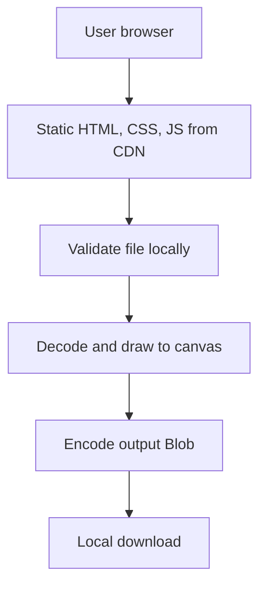
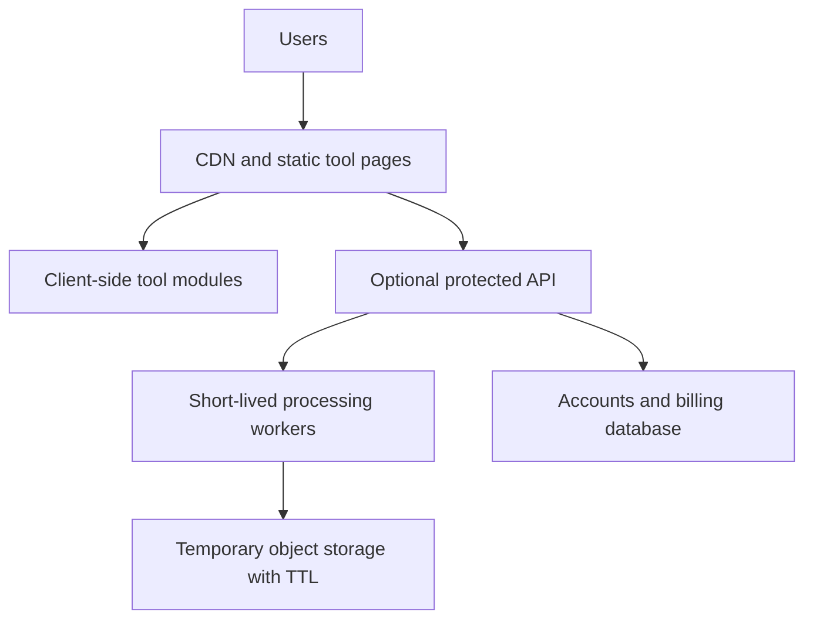
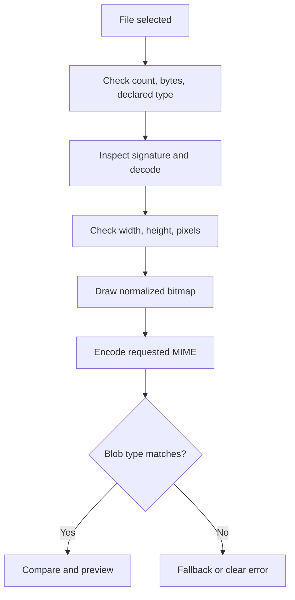

# 03 — Technical Architecture dan File Processing

## 1. Tech Stack Decision

### Frontend comparison

| Opsi | Kelebihan | Kekurangan | Fit MVP |
| --- | --- | --- | --- |
| Vanilla HTML/CSS/JS | paling sedikit abstraksi, bundle kecil, API browser langsung, mudah di-host statis | disiplin modularitas harus dibuat sendiri; UI state kompleks dapat verbose | **Terbaik** |
| React + Vite | component model matang, ekosistem besar | runtime/dependency lebih besar; belum diperlukan untuk satu tool | Layak bila UI berkembang cepat |
| Next.js | routing/SSR/SSG kuat, ekosistem SEO | mental model dan deployment lebih kompleks; server features tidak dipakai | Berlebihan untuk MVP |
| Astro | HTML-first, islands, bagus untuk banyak content pages | framework baru untuk dipelajari; interaktif tool tetap perlu JS module | Kandidat saat content/tool pages banyak |

### Pilihan final

**What:** semantic HTML, CSS, JavaScript ES modules, Vite untuk dev/build, TypeScript opsional setelah fondasi.  
**Why:** memecahkan kebutuhan secara langsung dengan dependency sangat sedikit; output statis mudah dipahami.  
**Trade-off:** developer harus menjaga boundaries dan state machine sendiri.  
**When to change:** pindah ke Astro ketika puluhan landing pages menyulitkan templating; pertimbangkan React/Preact hanya jika komponen interaktif silang-tool benar-benar kompleks.

TypeScript boleh dipakai sejak awal jika developer siap, tetapi jangan menunda MVP hanya untuk migrasi tipe. Rekomendasi praktis: JavaScript dengan JSDoc pada MVP, TypeScript saat tool kedua/ketiga menambah kontrak data.

### Hosting comparison

| Opsi | Kelebihan | Kekurangan | Keputusan |
| --- | --- | --- | --- |
| Cloudflare Pages | global static CDN, custom headers, HTTPS, cocok dengan no-backend | platform-specific `_headers`; fungsi tunduk kuota Workers | **Dipilih** |
| Vercel | DX bagus dan preview deploy | Hobby resmi dibatasi untuk penggunaan personal nonkomersial; situs beriklan memerlukan pemeriksaan plan | Tidak dipilih untuk target monetisasi |
| GitHub Pages | sangat sederhana | konfigurasi headers/security dan routing lebih terbatas | demo saja |

Cloudflare Pages dipilih karena situs statis dan monetisasi masa depan. Dokumen resmi Cloudflare menyediakan custom headers melalui file `_headers`. Vercel Hobby menyatakan penggunaan personal/non-commercial; karena target akhirnya AdSense, jangan mengandalkan Hobby sebagai hosting komersial tanpa upgrade/konfirmasi kebijakan. Lihat [Cloudflare Pages Headers](https://developers.cloudflare.com/pages/configuration/headers/) dan [Vercel Hobby](https://vercel.com/docs/plans/hobby). **Time-sensitive: diperiksa 29 Agustus 2026.**

### Database

**Tidak ada database.** Input berada di memori browser dan output diunduh langsung. Preferences kecil di masa depan dapat memakai localStorage opt-in; itu bukan alasan untuk database server.

### Image APIs

- File API untuk menerima bytes;
- `createImageBitmap()` jika tersedia untuk decode yang efisien;
- fallback `` + object URL;
- Canvas 2D untuk menggambar raster;
- `canvas.toBlob()` untuk encode main-thread;
- `OffscreenCanvas.convertToBlob()` di Worker sebagai enhancement setelah compatibility test;
- `URL.createObjectURL()` untuk preview/download dan `URL.revokeObjectURL()` untuk cleanup.

## 2. Current Architecture



Komponen:

- **Static shell:** HTML content, metadata, styles, module entry.
- **Tool controller:** finite state dan orchestration UI.
- **Validator:** byte, declared MIME, magic bytes minimum, decode, dimensions.
- **Processor:** decode → orient/draw → encode; tanpa akses jaringan.
- **Resource manager:** object URL, ImageBitmap, canvas, Blob reference cleanup.
- **Telemetry adapter:** menerima event yang sudah disanitasi, tidak pernah menerima objek File/Blob.

## 3. Future Architecture



Future components hanya ditambahkan bila dibutuhkan:

- route/static generator untuk 20+ halaman;
- server API untuk codec, file size, atau transformasi yang browser tidak mampu;
- authentication dan authorization untuk akun/premium;
- queue untuk pekerjaan berat;
- object storage dengan lifecycle deletion, bukan penyimpanan permanen default;
- rate limit/quotas per account/API key;
- database relasional untuk user, subscription, preferences, usage—not file contents.

## 4. Processing Pipeline



### Step-by-step contract

1. Hanya ambil `files[0]`; bila jumlah bukan satu, tolak dengan jelas.
2. Pastikan file ada, `size > 0`, `size ≤ 20 MB`.
3. Allowlist declared MIME: `image/jpeg`, `image/png`, `image/webp`; `image/avif` hanya feature flag.
4. Baca beberapa byte awal dan cocokkan signature dasar. Ini defense-in-depth, bukan bukti keamanan sempurna.
5. Decode dalam `try/catch`; decoding sukses menjadi validasi struktural kedua.
6. Dapatkan `width` dan `height`; tolak nol, dimensi sisi > 16,384 px, atau total > 40,000,000 pixels. Gunakan limit paling ketat yang terpenuhi.
7. Hitung estimasi raw RGBA `width × height × 4`; beri guard margin untuk source+canvas+output. Jangan hanya mempercayai ukuran file terkompresi.
8. Gambar ke canvas dengan dimensi yang diset eksplisit. Hapus referensi decoded bitmap sesudah draw (`ImageBitmap.close()` bila tersedia).
9. Encode MIME dan quality yang dipilih.
10. Verifikasi Blob non-null, size > 0, dan `blob.type` sesuai. Jika browser fallback PNG, jangan salah memberi ekstensi WebP/AVIF.
11. Bandingkan byte aktual dan buat object URL hasil.
12. Saat reset/retry/unload: revoke seluruh object URL; set canvas width/height ke 0; kosongkan references.

## 5. Format Policy

### JPEG

- cocok untuk foto, lossy, tanpa alpha;
- quality preset efektif;
- gambar bertransparansi yang dikonversi ke JPEG perlu background eksplisit (default putih) dan konfirmasi pengguna.

### PNG

- lossless dan transparansi;
- Canvas PNG tidak menyediakan kontrol kualitas lossy yang universal;
- “compress PNG” tanpa library khusus mungkin tidak memberi penghematan berarti;
- MVP boleh re-encode PNG dan menyarankan WebP. Jangan menjanjikan kompresi PNG besar.

### WebP

- lossy/lossless modern dan mendukung alpha;
- gunakan jika runtime encoder test lolos;
- output MIME diverifikasi, bukan mengandalkan user agent string.

### AVIF

- decode dan ecosystem makin luas, tetapi encode Canvas tidak boleh diasumsikan;
- hidden feature flag/runtest; jika gagal, option tidak ditampilkan;
- jangan memasukkan codec WASM besar sebelum ada bukti kebutuhan dan audit supply-chain/performance.

## 6. Orientation, Metadata, dan Quality

- `createImageBitmap(file, { imageOrientation: 'from-image' })` dapat dipakai bila kompatibel; fallback diuji untuk EXIF orientation.
- Canvas re-encode biasanya membuang banyak metadata. UI/privacy page menyatakan bahwa metadata *may be removed*, bukan jaminan universal tanpa tests.
- ICC/color profile dan wide-gamut dapat berubah melalui Canvas. Uji visual; MVP tidak menjanjikan color-managed professional workflow.
- Jangan melakukan upscale.
- Untuk penghematan, optional max dimension dapat menjadi future setting, tetapi tidak aktif diam-diam.

## 7. Concurrency dan Main Thread

MVP single-file dapat mulai di main thread dengan yielding sebelum pekerjaan berat. Pindahkan ke Web Worker/OffscreenCanvas jika pengujian menunjukkan INP buruk atau freeze >100 ms pada perangkat target. `OffscreenCanvas.convertToBlob()` tersedia di Worker tetapi dukungan detail bervariasi; lihat [MDN OffscreenCanvas](https://developer.mozilla.org/en-US/docs/Web/API/OffscreenCanvas/convertToBlob).

**What:** main-thread baseline + Worker enhancement.  
**Why:** compatibility dan kode lebih sederhana.  
**Trade-off:** gambar besar dapat menyebabkan jank.  
**When to change:** p75 INP >200 ms atau long task processing >200 ms pada device test.

## 8. Database Strategy

Image Compressor **tidak membutuhkan database** karena tidak ada state server yang harus bertahan. Static assets berada di deployment; gambar input/output adalah objek lokal sementara.

Database baru relevan untuk:

- akun dan preferences lintas perangkat;
- subscription dan entitlement;
- API keys dan usage quota;
- server job status;
- audit/security events yang benar-benar diperlukan;
- shared history yang diminta pengguna.

Saat dibutuhkan, pilih hosted Postgres sederhana (mis. Supabase/Neon sesuai evaluasi resmi saat itu) dan simpan metadata minimum. File berada di object storage dengan TTL, bukan kolom database. Jangan memilih vendor sebelum requirements dan data residency jelas.

## 9. Project Structure

```text
image-tools/
├─ public/
│  ├─ _headers
│  ├─ robots.txt
│  ├─ sitemap.xml
│  └─ icons/
├─ src/
│  ├─ styles/
│  │  ├─ tokens.css
│  │  ├─ base.css
│  │  └─ components.css
│  ├─ shared/
│  │  ├─ dom.js
│  │  ├─ errors.js
│  │  ├─ format-bytes.js
│  │  ├─ telemetry.js
│  │  └─ resource-manager.js
│  └─ tools/
│     └─ image-compressor/
│        ├─ index.js
│        ├─ state.js
│        ├─ validate-image.js
│        ├─ process-image.js
│        └─ view.js
├─ tests/
│  ├─ unit/
│  ├─ fixtures/
│  └─ e2e/
├─ image-compressor.html
├─ privacy.html
├─ package.json
├─ package-lock.json
└─ vite.config.js
```

Setelah 5–10 tools, evaluasi Astro untuk shared layouts dan route generation. Sebelum itu, jangan membangun plugin system generik.

## 10. Module Rules

- `validate-image` menerima `File`, mengembalikan metadata aman atau stable error code.
- `process-image` menerima validated input + settings, mengembalikan Blob + dimensions; tidak menyentuh DOM/analytics.
- `view` hanya merender state melalui `textContent`, property, atau DOM API aman.
- `telemetry` hanya menerima allowlisted scalar/bucket; tolak `File`, `Blob`, URL `blob:`, dan key tak dikenal.
- state transitions eksplisit; action yang datang dari state salah diabaikan/log development-only.

