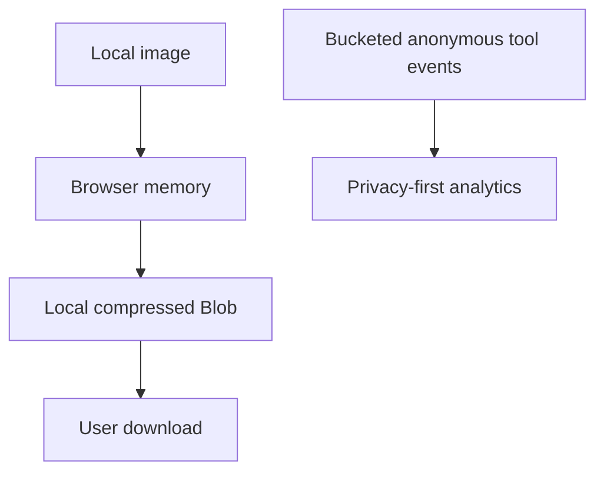

# 04 — Security Architecture dan Privacy Model

## 1. Security Scope dan Assumptions

MVP adalah situs statis tanpa endpoint upload, akun, atau secret. Ini menghilangkan banyak risiko server, tetapi input gambar tetap untrusted dan browser/dependency/supply chain tetap attack surface.

Trust boundaries:

1. file lokal masuk ke JavaScript aplikasi;
2. decoder browser menginterpretasikan file;
3. DOM menampilkan metadata/nama;
4. CDN mengirim static assets;
5. analytics menerima event terbatas;
6. deployment pipeline mengubah kode produksi.

Assets yang dilindungi:

- isi dan metadata file pengguna;
- perangkat/memori/CPU pengguna;
- integritas kode dan download output;
- reputasi domain dan kepercayaan pengguna;
- akun repository/deployment;
- analytics yang tidak tercemar/spam.

## 2. Threat Model

| Asset | Threat | Attack vector | Risk | Mitigation |
| --- | --- | --- | --- | --- |
| Browser/device | resource exhaustion | file kecil terkompresi dengan dimensi sangat besar | High | limit byte + width/height/pixel + estimasi RGBA sebelum canvas |
| Browser/device | malformed decoder exploit | crafted JPEG/PNG/WebP | Medium/High | modern browser, allowlist, decode in isolated browser primitive, limits; do not parse with unsafe custom native code |
| DOM integrity | XSS via filename | filename berisi HTML/script | High | `textContent`; never `innerHTML`; CSP; sanitized download name |
| DOM integrity | SVG active content | SVG di-upload/preview | High | SVG tidak diterima pada MVP |
| User privacy | file exfiltration | analytics/error SDK receives File, filename, Blob URL | High | typed/allowlisted telemetry adapter; no third-party error SDK initially; Network tests |
| User privacy | lingering object URL | URL tidak direvoke | Medium | centralized resource manager; revoke on replace/reset/unload |
| Output integrity | MIME/extension mismatch | encoder fallback ke PNG | Medium | verify `blob.type`; derive extension from verified MIME |
| Availability | UI freeze | synchronous large canvas work | Medium | limits, async boundary, Worker enhancement, cancel stale jobs |
| Site integrity | dependency compromise | malicious npm update | High | minimal deps, lockfile, pinned CI, review updates, audit/provenance |
| Site integrity | deployment takeover | compromised Git/Cloudflare account | High | MFA/passkeys, least privilege, branch protection, reviewed preview |
| Site reputation | content injection | compromised third-party ad/analytics script | High | delay ads, CSP allowlist, SRI where applicable, vendor minimization |
| Infrastructure | traffic spike/DDoS | bots request static pages | Low/Medium | CDN caching, provider protections, no expensive endpoint |
| Analytics | bot pollution | automated page/event requests | Medium | accept approximate data; bot filtering; no business-critical decisions from one metric |
| Secrets | secret exposure | API key in frontend/env prefixed for build | High | no secrets in static app; secret scanning; future secrets server-only |

### Future backend threats

| Threat | Risk | Required mitigation before launch |
| --- | --- | --- |
| SSRF through image URL/import | High | no arbitrary URL fetch; allowlist/proxy isolation; DNS/IP revalidation; block private/link-local ranges |
| unrestricted upload | High | authenticated/limited presigned flow; byte/type/pixel scan; quarantine; TTL deletion |
| broken authorization | Critical | deny-by-default object ownership checks on every resource |
| request forgery/CSRF | High | SameSite cookies, CSRF protection, origin checks for state change |
| API abuse/cost attack | High | rate limit, quota, body size, job budget, circuit breaker, billing alerts |
| malicious output delivery | High | safe `Content-Type`, `Content-Disposition: attachment`, nosniff, isolated domain if needed |

## 3. File Validation Policy

Validation berlapis:

1. UI `accept` hanya hint, bukan kontrol keamanan.
2. Check file count, nonzero bytes, max bytes.
3. Allowlist `file.type`; tidak percaya ekstensi.
4. Signature check minimum:
   - JPEG: `FF D8 FF`;
   - PNG: `89 50 4E 47 0D 0A 1A 0A`;
   - WebP: `RIFF` + `WEBP` pada offset yang sesuai.
5. Decode sukses dengan API browser.
6. Dimension/pixel guard sebelum membuat canvas besar.
7. Output Blob diverifikasi ulang.

Signature check tidak menjamin file aman; ia mencegah mismatch sederhana. Jangan membangun image parser manual yang besar untuk “lebih aman” tanpa keahlian khusus.

### Malicious filenames

- tampilkan melalui `textContent`;
- batasi panjang tampilan, misalnya 120 karakter;
- normalisasi nama download: ambil basename, ganti control/forbidden characters dengan `-`, trim, gunakan fallback `compressed-image`;
- extension selalu berasal dari MIME output, bukan input;
- jangan memakai nama file dalam DOM ID, URL route, log, analytics, atau header.

## 4. Memory dan Temporary Resource Handling

- file tidak disalin ke base64/Data URL; gunakan Blob/object URL untuk menghindari overhead;
- revoke preview lama sebelum membuat preview baru;
- close `ImageBitmap` setelah digambar;
- kosongkan canvas dengan `canvas.width = 0; canvas.height = 0` saat reset;
- abort/ignore hasil job lama memakai monotonically increasing job ID atau AbortController jika API mendukung;
- output Blob dilepas setelah download/reset; garbage collection tetap dikendalikan browser;
- pada `pagehide`, lakukan cleanup best-effort.

Browser dapat menyimpan Blob sementara di memori atau cache internal. Klaim privacy harus mengatakan “tidak dikirim atau disimpan oleh layanan kami”, bukan menjanjikan browser tidak pernah memakai disk/cache. MDN menjelaskan Blob hasil `toBlob()` dapat berada di memori atau cache disk atas kebijakan user agent.

## 5. Privacy Model

### Data flow MVP



Tidak ada panah dari gambar ke analytics/server.

### Data inventory

| Data | Purpose | Destination | Retention |
| --- | --- | --- | --- |
| File bytes | compression | local browser only | sampai reset/tab ditutup/GC |
| Preview object URL | display | local browser only | direvoke saat diganti/reset |
| Output Blob | download | local browser only | sampai reset/tab ditutup/GC |
| Bucketed tool event | product reliability | analytics vendor | sesuai konfigurasi vendor; dokumentasikan |
| Server/CDN access logs | delivery/security | hosting provider | provider-defined; evaluasi dan disclose |

### Privacy copy

Near upload:

> Your image is processed on this device and is not uploaded to our servers.

Privacy page harus menjelaskan:

- file tidak keluar browser pada MVP;
- tidak ada akun/history cloud;
- analytics hanya event dan bucket non-file;
- CDN masih dapat menerima data koneksi normal seperti IP/user-agent sesuai operasinya;
- browser mengelola memori/cache lokal;
- jika kelak ada server tool, tool itu diberi label berbeda dan consent/notice jelas.

## 6. XSS dan DOM Safety

- gunakan template HTML statis, `textContent`, `setAttribute` dengan allowlist, dan property DOM;
- tidak ada `eval`, `new Function`, inline event handler, atau string-built script;
- tidak merender EXIF/comment metadata ke HTML pada MVP;
- URL download harus berasal dari `URL.createObjectURL(verifiedBlob)`;
- external links memakai HTTPS; `target="_blank"` disertai `rel="noopener noreferrer"`;
- dependencies yang membutuhkan unsafe-inline/unsafe-eval ditolak kecuali alasan dan review kuat.

## 7. Security Headers

Contoh `public/_headers` untuk Cloudflare Pages tanpa analytics/ads pihak ketiga:

```text
/*
  Content-Security-Policy: default-src 'self'; script-src 'self'; style-src 'self'; img-src 'self' blob: data:; font-src 'self'; connect-src 'self'; object-src 'none'; base-uri 'self'; form-action 'self'; frame-ancestors 'none'; upgrade-insecure-requests
  Strict-Transport-Security: max-age=31536000; includeSubDomains
  X-Content-Type-Options: nosniff
  Referrer-Policy: strict-origin-when-cross-origin
  Permissions-Policy: camera=(), microphone=(), geolocation=(), payment=(), usb=()
  Cross-Origin-Opener-Policy: same-origin

/assets/*
  Cache-Control: public, max-age=31536000, immutable

/*.html
  Cache-Control: public, max-age=0, must-revalidate
```

Cloudflare Pages mendukung header melalui `_headers`; lihat [dokumentasi resmi](https://developers.cloudflare.com/pages/configuration/headers/). **Time-sensitive: periksa syntax/limits lagi saat deployment.**

### Header rationale

| Header | Fungsi/risiko | Aman untuk MVP? | Dampak/notes |
| --- | --- | --- | --- |
| CSP | batasi sumber script/style/image/connect; kurangi XSS/exfiltration | Ya | analytics/ads masa depan memerlukan allowlist terukur; jangan langsung wildcard |
| HSTS | paksa HTTPS setelah kunjungan pertama | Ya setelah HTTPS/domain stabil | `includeSubDomains` hanya jika semua subdomain HTTPS; preload bukan default |
| nosniff | cegah MIME sniffing | Ya | pastikan static assets memiliki MIME benar |
| Referrer-Policy | batasi URL detail pada navigasi lintas origin | Ya | strict-origin masih memberi origin untuk analytics tujuan |
| Permissions-Policy | matikan browser capabilities yang tidak dipakai | Ya | tool kamera masa depan perlu route/header berbeda |
| frame-ancestors | cegah embedding/clickjacking | Ya | jika embed resmi dibutuhkan, ubah allowlist |
| COOP | isolasi browsing context | Umumnya | dapat memengaruhi OAuth/popups masa depan; uji |

`X-Frame-Options: DENY` boleh ditambahkan sebagai defense untuk browser lama, tetapi CSP `frame-ancestors 'none'` adalah kontrol modern. Jangan menambahkan COEP/CORP secara membabi buta karena dapat memblokir assets/ads; gunakan hanya saat Worker/shared memory benar-benar memerlukannya.

Ketika Cloudflare Web Analytics diaktifkan, CSP perlu mengizinkan beacon resmi yang disebut di dokumentasi Cloudflare. Jangan longgarkan CSP ke `*`; tambahkan host spesifik dan verifikasi requests. Referensi: [data collection Cloudflare Web Analytics](https://developers.cloudflare.com/web-analytics/data-metrics/data-origin-and-collection/).

## 8. CSRF, SSRF, CORS, Path Traversal

- CSRF tidak relevan pada MVP karena tidak ada state-changing server request/cookie session.
- SSRF tidak relevan karena server tidak mengambil URL. Jangan menambah “paste image URL” tanpa desain backend yang aman.
- CORS tidak perlu dilonggarkan untuk static same-origin app. Hindari `Access-Control-Allow-Origin: *` tanpa kebutuhan.
- Path traversal tidak terjadi dari download lokal jika nama hanya menjadi atribut `download`; tetap normalisasi nama dan jangan pernah memakai nama pengguna sebagai server path di masa depan.

## 9. Dependency dan Supply-Chain Security

Aturan:

1. Runtime dependency MVP idealnya nol.
2. Vite/test tools adalah dev dependencies; commit lockfile.
3. Install package hanya setelah memeriksa maintainer, repo, update cadence, transitive deps, license, dan advisories.
4. Gunakan `npm ci` di CI, bukan floating install.
5. Jalankan `npm audit` sebagai signal; triage dampak nyata, jangan auto-fix major secara buta.
6. Dependabot/Renovate membuat PR kecil; review changelog dan run full tests.
7. Pin GitHub Actions ke commit SHA untuk workflow sensitif jika digunakan.
8. Aktifkan secret scanning dan branch protection.
9. Jangan menyimpan `.env`, token, service credential, atau private key di repo. Static frontend tidak boleh memiliki secret.
10. Build dari CI yang terkunci; deployment production hanya dari protected branch.

### Workflow pemula mingguan/bulanan

- setiap PR: `npm ci`, lint, unit, build, e2e smoke, audit high/critical;
- mingguan: review dependency alerts dan failed deploy;
- bulanan: update dependencies dalam PR terpisah, browser compatibility test;
- sebelum release besar: audit CSP/network, Lighthouse/accessibility manual, restore/rollback drill.

## 10. Security Verification

- DevTools Network: pilih file bernama unik; pastikan tidak ada request membawa nama/byte/blob URL.
- Test filename payload: `.jpg`; harus tampil sebagai teks.
- Test polyglot/renamed `.exe`, truncated image, zero-byte, 20 MB+1 byte, huge dimensions.
- Test repeated select/reset 50 kali; memory tidak tumbuh tanpa batas.
- Run CSP in report-only selama staging jika menambah analytics/ads; rapikan violation, lalu enforce.
- Scan headers dengan browser/security scanner; verifikasi pada response production, bukan hanya file config.
- Jangan mengunggah fixture sensitif atau malware nyata ke repo publik; gunakan synthetic malformed fixtures aman.

