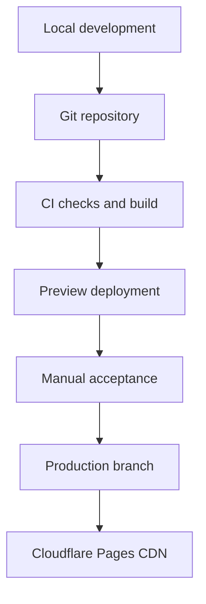

# 06 — Testing, Deployment, Cost Model, dan Scalability

## 1. Testing Strategy

Testing mengikuti risiko: hasil file benar, resource tidak bocor, file tidak keluar browser, dan alur tetap accessible.

### Unit tests

- byte formatting dan savings calculation termasuk zero/negative;
- MIME→extension mapping;
- filename sanitization;
- signature detection;
- byte/pixel/dimension limit boundaries;
- state transitions dan stale job rejection;
- telemetry allowlist menolak File/Blob/free text;
- error mapping tidak menampilkan exception mentah.

### Functional/integration

| Scenario | Expected |
| --- | --- |
| JPEG valid | preview, compress, MIME benar, download dapat dibuka |
| PNG transparan | alpha terjaga pada PNG/WebP; JPEG memberi background behavior jelas |
| WebP valid | runtime-supported process sukses |
| AVIF | option hanya muncul bila runtime encode/decode test lolos |
| animated GIF/APNG | ditolak, tidak diam-diam diratakan |
| renamed executable/text | gagal signature/decode |
| truncated image | error aman, cleanup |
| 0-byte | ditolak sebelum decode |
| 20 MB exact | sesuai policy diterima; 20 MB + 1 byte ditolak |
| 40 MP exact | sesuai policy; +1 pixel total ditolak |
| quality change | output aktual berubah pada lossy formats |
| output larger | copy “larger”, retry options, download tetap opsional |
| reset during processing | stale result tidak muncul; URLs/canvas dibersihkan |
| repeat 50 cycles | tidak ada tren memory leak besar |

### Browser matrix

- Chrome latest-1/latest: Windows, Android;
- Edge latest-1/latest: Windows;
- Firefox latest-1/latest: Windows/macOS;
- Safari latest-1/latest: macOS/iOS jika perangkat tersedia;
- fallback test ketika `createImageBitmap`, WebP encode, OffscreenCanvas, atau AVIF tidak tersedia.

Jangan menggunakan user-agent allowlist. Feature detection menentukan opsi format/pipeline.

### Mobile

- portrait 320/360/390 CSS px;
- touch target, virtual keyboard (jika ada), scroll, preview height;
- low-memory Android dengan file besar;
- iOS Safari download behavior dan nama file;
- rotate/resume/background tab;
- reduced motion dan dark mode hanya jika dark mode diimplementasikan.

### Accessibility

- automated: axe-core/Lighthouse sebagai baseline;
- manual keyboard-only seluruh happy/error flow;
- screen reader smoke: NVDA+Chrome/Firefox dan VoiceOver+Safari bila tersedia;
- zoom 200%/400%, reflow, contrast, forced colors/high contrast;
- status tidak diumumkan berulang; error terkait control;
- drag/drop tidak menjadi satu-satunya cara.

### Security/privacy

- malicious filename; CSP violation; no inline/eval;
- network capture saat file dipilih/diproses/download;
- no filename/bytes/object URL dalam analytics/log;
- headers produksi;
- dependency audit dan secret scan;
- malformed/boundary files; rapid repeated actions; double click.

### Performance

- Lighthouse mobile staging;
- field CWV production setelah traffic cukup;
- long tasks dan memory timeline selama file 12/24/40 MP;
- bundle size gate;
- ads/analytics tested separately sebelum rollout.

## 2. Test Fixtures

Repository menyimpan synthetic/non-sensitive fixtures:

- 1×1 hingga 40 MP JPEG/PNG/WebP;
- transparent PNG;
- EXIF orientation variants;
- flat graphic/noisy photo (compression behavior berbeda);
- preoptimized image;
- zero byte, wrong signature, truncated headers;
- filenames Unicode panjang dan XSS-like.

Jangan commit foto pribadi atau copyrighted sample tanpa hak.

## 3. Deployment Architecture

### Local development

1. Install current LTS Node yang didukung Vite.
2. `npm ci` dari committed lockfile.
3. `npm run dev`; gunakan localhost.
4. `npm test`, `npm run build`, `npm run preview` sebelum push.

### Repository dan CI

- protected `main`;
- feature branch + pull request;
- checks: format/lint, unit, build, e2e smoke, bundle budget, audit policy;
- secrets hanya di platform environment, tetapi MVP seharusnya tidak memiliki runtime secret;
- deployment production dari commit/branch yang teridentifikasi.

### Cloudflare Pages

- framework preset Vite/static;
- build command: `npm run build`;
- output: `dist`;
- preview deploy untuk PR/branch;
- custom domain setelah staging lulus;
- HTTPS aktif dan canonical domain dipilih (`www` atau apex, satu saja);
- security/cache headers dari `_headers`;
- redirect domain alternatif ke canonical.

Cloudflare Pages free memiliki limit yang dapat berubah; dokumentasi resmi pada Agustus 2026 menyebut hingga 20.000 files/site pada Free dan Pages Functions berbagi kuota Workers. MVP tidak memakai Functions. Periksa ulang [Pages limits](https://developers.cloudflare.com/pages/platform/limits/) dan [Pages Functions pricing](https://developers.cloudflare.com/pages/functions/pricing/) sebelum launch. **Time-sensitive.**

### DNS, environment, rollback

- DNS berada di provider dengan MFA dan registrar lock;
- gunakan CAA bila proses sertifikat dikelola dengan benar;
- tidak ada secret untuk static tool;
- environment variables build-time dianggap dapat terlihat di bundle kecuali jelas server-only;
- rollback melalui previous successful deployment pada dashboard/provider;
- setelah rollback: smoke test canonical, headers, compressor, download, analytics.

## 4. Cost Model

Asumsi:

- client-side processing, tidak ada upload/storage/backend/database;
- Cloudflare Pages static delivery;
- satu domain generik `.com`;
- estimasi kasar USD dan rupiah memakai pembulatan **Rp16.000/USD** hanya untuk perencanaan, bukan kurs aktual;
- domain diasumsikan USD 10–20/tahun (Rp160.000–320.000/tahun); harga registrar/pajak/renewal harus dicek saat pembelian;
- development time dan biaya legal/content tidak dihitung.

### Stage 1 — 0–1.000 visitors/month

| Komponen | Estimasi | Catatan |
| --- | ---: | --- |
| Domain | Rp160k–320k/tahun | renewal bisa berbeda dari promo |
| Hosting/CDN | Rp0/bulan | jika tetap pada eligible static free tier |
| Database/storage/server | Rp0 | tidak digunakan |
| Analytics | Rp0 | Cloudflare Web Analytics, cek terms/limits |
| Monitoring | Rp0 | dashboard + manual smoke |
| Total cash | sekitar Rp160k–320k/tahun | belum termasuk waktu |

### Stage 2 — 10.000–100.000 visitors/month

| Komponen | Estimasi | Catatan |
| --- | ---: | --- |
| Domain | Rp160k–320k/tahun | tetap |
| Static hosting/CDN | Rp0–320k/bulan | kemungkinan tetap free; siapkan paid buffer |
| Database/storage/server | Rp0 | selama tools client-side |
| Analytics/monitoring | Rp0–800k/bulan | tergantung vendor/retention |
| Consent/legal tooling | Rp0–800k/bulan | bisa manual/open-source atau vendor |
| Total cash | Rp0–1,92jt/bulan + domain | upgrade hanya berbasis kebutuhan |

### Stage 3 — 1.000.000+ visitors/month

| Komponen | Estimasi | Catatan |
| --- | ---: | --- |
| Domain | Rp160k–320k/tahun | kecil dibanding operasional |
| Static CDN/hosting | Rp0–1,6jt+/bulan | tergantung plan/abuse/support; verify contract |
| Database/storage/server | Rp0 untuk client-only | naik cepat hanya bila backend tools ditambah |
| Analytics/monitoring | Rp800k–8jt+/bulan | sampling/retention mengendalikan biaya |
| Security/consent/support | Rp800k–8jt+/bulan | manusia dan tooling mulai dominan |
| Total | sangat variabel, Rp1,6jt–17,6jt+/bulan | bukan quote vendor |

Static, client-side architecture membuat bandwidth page kecil dan biaya komputasi server tidak mengikuti jumlah compression. Pada skala besar, dukungan, security, analytics, legal, dan abuse lebih mungkin menjadi biaya utama.

### Safeguards biaya

- jangan menghubungkan billing pay-as-you-go sebelum budget alerts/limits dipahami;
- matikan/tetapkan hard cap untuk optional Functions, storage, transforms jika provider memungkinkan;
- gunakan separate project/account boundaries untuk eksperimen;
- sampling analytics dan retention pendek;
- jangan log event per progress tick;
- dashboard mingguan untuk usage dan monthly invoice review;
- feature flag untuk mematikan endpoint/analytics vendor mahal;
- load test backend future dengan per-job cost model sebelum production.

Cloudflare Workers Free pada dokumentasi Agustus 2026 memiliki 100.000 requests/day dan Paid minimum USD 5/bulan; angka ini tidak relevan untuk static-only MVP tetapi relevan jika Functions ditambah. Lihat [Workers pricing](https://developers.cloudflare.com/workers/platform/pricing/) dan [limits](https://developers.cloudflare.com/workers/platform/limits/). **Time-sensitive.**

## 5. Scalability Strategy

### Traffic spike pada MVP

- HTML/CSS/JS cacheable di CDN;
- tidak ada origin application/database bottleneck;
- compression memakai CPU/memori masing-masing perangkat;
- deploy static assets immutable;
- analytics failure tidak boleh memblokir tool;
- jika analytics overload, sample/disable telemetry, utility tetap bekerja.

### 20+ tools

- route per tool dan shared layout/tokens;
- lazy-load module tiap tool;
- content collections/build-time generation (evaluasi Astro);
- per-tool tests/metadata manifest sederhana;
- jangan ship seluruh codec/tool JavaScript pada setiap page;
- sitemap otomatis dari allowlisted production routes.

### Jika backend diperkenalkan

- endpoint terpisah dari static delivery;
- explicit body limits sebelum parsing;
- authenticated/rate-limited high-cost operations;
- queue + job timeout + concurrency cap;
- temporary storage TTL dan lifecycle deletion;
- caching hanya untuk safe/public deterministic artifacts; file privat tidak masuk shared cache;
- graceful rejection saat kapasitas penuh dan status transparan;
- per-job budget, billing alerts, circuit breaker.

## 6. Operational Runbooks

### Failed deployment

1. Stop promotion.
2. Roll back ke last known-good deployment.
3. Smoke test home/tool/download/headers.
4. Catat root cause dan test pencegah.

### Unexpected billing

1. Identifikasi service/metric dan matikan feature flag jika aman.
2. Terapkan limit/sampling.
3. Hubungi provider bila anomalous abuse.
4. Jangan menghapus data/log yang diperlukan untuk investigasi tanpa retention decision.

### Security incident

1. Cabut token/sessions yang terdampak dan hentikan deploy.
2. Roll back/disable third party.
3. Pertahankan bukti minimum dan tentukan scope.
4. Perbaiki, test, deploy, dan komunikasikan sesuai dampak/kewajiban.

